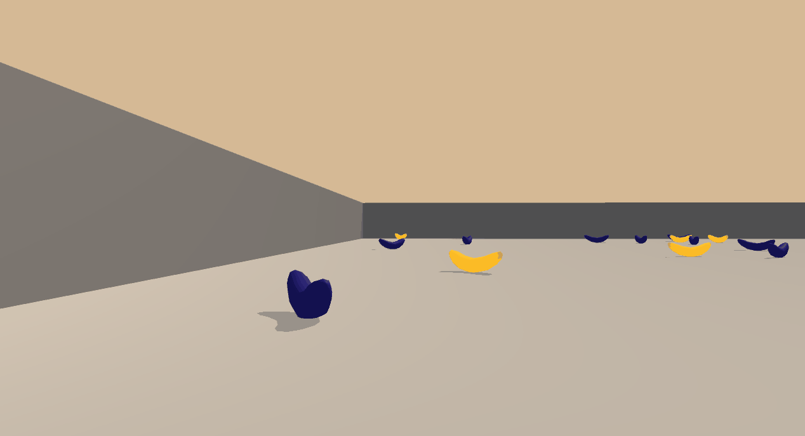

# udacity-drl-navigation
Udacity Deep Reinforcement Learning Nanodegree project repo.

# Project details
The task in this project was to train an agent to solve an environment where the agent/player needs to navigate in a square 3D world and collect yellow bananas while avoiding contact with blue bananas. Note: this is *not* the same Banana environment that is provided as an example in the [Unity ML-Agents toolkit](https://github.com/Unity-Technologies/ml-agents).

The task is episodic and considered solved when the agent gains a score of +13 over 100 consecutive episodes. In the provided solution, the agent is trained for 1000 episodes and it gains an average reward of +15 over 100 consecutive episodes at the end of training.

## Trained agent in action

## Rewards
The agent receives a reward of `+1` for each collected yellow banana and a reward of `-1` for each collected blue banana.

## State space
The state space has 37 dimensions that contain the agent's velocity and features that encode a ray-traced perception of objects the agent faces in the forward direction.

## Actions
At each state, the agent has four discrete actions available:

| Action | Description   |
|--------|---------------|
| 0      | Move forward  |
| 1      | Move backward |
| 2      | Turn left     |
| 3      | Turn right    |

# Getting started
This code was developed and tested on Python 3.6.4 and PyTorch 0.4.1. The included environment executable is for Windows. The links for Linux/Mac environments are provided below (provided by Udacity, might not work in the future):

[Linux](https://s3-us-west-1.amazonaws.com/udacity-drlnd/P1/Banana/Banana_Linux.zip)

[MacOS](https://s3-us-west-1.amazonaws.com/udacity-drlnd/P1/Banana/Banana.app.zip)

## Installing dependencies
A working Python installation is required. An easy way is to install using [Anaconda](https://www.anaconda.com/download/). To install a specific Python version using Anaconda, see [link](http://docs.anaconda.com/anaconda/faq/#how-do-i-get-the-latest-anaconda-with-python-3-5).

Additionally, PyTorch needs to be installed by first running (if you installed Python with Anaconda) 

`conda install pytorch -c pytorch` 

and then

`pip3 install torchvision` 

from the command line. See [PyTorch website](https://pytorch.org/) for more instructions and details.

Finally, Unity ML-Agents version 0.4.0b needs to be installed from [here](https://github.com/Unity-Technologies/ml-agents/releases/tag/0.4.0b). To install, download the .zip archive and unzip, navigate to the `python` directory, and run 

`pip3 install .`. 

For additional help see the [installation guide](https://github.com/Unity-Technologies/ml-agents/blob/master/docs/Installation.md) (Note! the link is for new version of the ML-Agents where some of the syntax has changed from the version used in this project).

# Instructions to run the code
First clone or download this repository. 

Easiest way to replicate the results is to launch a jupyter notebook (contained with Anaconda installation of Python) by running 

`jupyter notebook` 

from the command line in the project root. Then, open the [Report.ipynb](Report.ipynb) file from the jupyter webpage UI and follow the instructions there.

If you want to explore the code further, it is organized as follows under the `dql/` folder:

1. `agent.py` contains code for the agent.
2. `model.py` contains the neural network code that is used by the agent.
3. `dqn_trainer.py` contains code that is used to train the agent.
4. Saved weights for the dueling network architecture can be found under `dql/models/dueling_dqn_1000_iters.pth` (to see how to load the trained model, refer to the [Report](Report.ipynb)).
